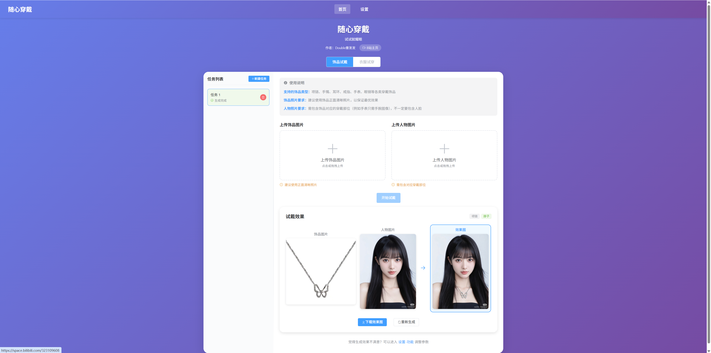

# 随心穿戴

<div align="center">

[中文](README.md) | [English](docs/README_en.md)

[](https://www.python.org/)
[](https://nodejs.org/)
[](https://vuejs.org/)
[](https://fastapi.tiangolo.com/)
[](https://space.bilibili.com/323109608)
[](LICENSE)

**作者：Double 童发发** · [B 站主页](https://space.bilibili.com/323109608)

</div>

## 📖 项目简介

得益于扩散模型的蓬勃发展，市面上已经出现了很多虚拟衣服试穿的成熟实现方案。然而，在饰品虚拟穿戴场景中，由于饰品具备种类繁多、形态各异、大小不一、佩戴位置各不相同等特点，虚拟饰品试戴的实现难度要远大于虚拟衣服试穿。我曾尝试在 2024 年基于扩散模型+条件控制+Inpainting 思路开发过虚拟饰品试戴工具，因为效果不佳，所以最终放弃了。2025 年是令人振奋的一年，以 Nano Banana、通义万象为代表的图像生成模型，在图像生成质量上相比 2024 年有了非常巨大的提升，特别是在文本生成、微小细节控制等方面。此外，随着多模态大模型技术的日益成熟，视觉语言大模型在视觉理解中的能力得到了极大提升。在上述背景下，我决定一步到位，结合视觉语言大模型和图像生成模型，开发一个随心穿戴工具，不仅仅能够实现饰品的虚拟试戴，也能够兼容衣服、科技产品等万物的试戴。

本项目依托视觉语言大模型与图像生成模型实现，用户只需上传穿戴物品照片与包含佩戴部位的人物照片（也可以不包含人脸），本系统就能够将穿戴物品自然地佩戴到人物照片上，生成逼真的试戴效果图。其中，视觉语言大模型负责对用户上传的穿戴物品照片进行深度理解，提取穿戴物品类型、佩戴位置和穿戴物品细节区域，并将信息返回给图像生成模型；图像生成模型负责将穿戴物品图像与人物图像进行智能融合，生成逼真的试戴效果图。

由于项目体量较大，且功能复杂，后续我会持续迭代开发更多功能特性，欢迎大家持续关注！

本项目使用了 AI Coding 技术辅助编程，在这非常感谢以[Claude Code](https://claude.com/product/claude-code)、[Cursor](https://cursor.com/)、[GitHub Copilot](https://github.com/features/copilot)为代表的一系列 AI Coding 工具，它们极大地提高了我的编程效率，让我能够更加专注于算法逻辑的实现。



## 🎯 核心特性

### v1.1.0：服装试穿功能支持啦！

- **智能识别**：基于视觉语言大模型自动识别饰品/服装类型和最佳穿戴位置
- **高质量生成**：基于优质图像生成模型，生成自然逼真的试戴/试穿效果
- **灵活配置**：同时支持手动指定饰品/服装类型和位置，满足精细化需求
- **易于部署**：提供一键启动脚本，快速搭建本地服务
- **异步架构**：支持多个试戴/试穿任务同时异步运行
- **定期任务清理**：定期清理过期任务及其相关文件，避免占用过多存储空间

## 📋 环境要求

- Python >= 3.13
- Node.js >= 18
- 阿里云 DashScope API Key（用于通义千问 VL 模型与通义万象图像生成模型）

## 🚀 快速开始

### 1. 克隆项目

```bash
git clone https://github.com/TongTong313/try-on-anything.git
cd try-on-anything
```

### 2. 配置 API Key

系统支持两种 API Key 配置方式：

**方式一：使用环境变量**

这种方式的好处就是一次性配置后续多次使用，也基本不会出现 API Key 泄露的风险，因为环境变量是在本地机器上配置的，不会上传到远程仓库。

创建 `.env` 文件或设置环境变量：

**Windows (PowerShell):**

```powershell
# 临时设置（当前会话）
$env:DASHSCOPE_API_KEY="your-api-key-here"

# 永久设置（用户级别）
[System.Environment]::SetEnvironmentVariable('DASHSCOPE_API_KEY', 'your-api-key-here', 'User')
```

**Linux/Mac (Bash):**

```bash
# 临时设置（当前会话）
export DASHSCOPE_API_KEY="your-api-key-here"

# 永久设置（添加到配置文件）
echo 'export DASHSCOPE_API_KEY="your-api-key-here"' >> ~/.bashrc
source ~/.bashrc
```

**注意：**

- 环境变量配置 API Key 方式目前**仅支持阿里云 DashScope**，如需申请请访问：https://bailian.console.aliyun.com/

**方式二：在前端设置页面配置（推荐）**

当然，如果你懒得配置环境变量，也可以在前端设置页面配置 API Key，一次配置后第二次使用时就不需要再配置了，但是 API Key 泄露风险相对更高些。

1. 启动应用后，访问前端页面
2. 点击顶部导航栏的"设置"按钮
3. 选择"手动输入 API Key"
4. 分别输入 VL 模型和图像生成模型的 API Key
5. 点击"保存设置"

**注意：**

- 前端页面配置 API Key 方式目前**仅支持阿里云 DashScope**，如需申请请访问：https://bailian.console.aliyun.com/
- 强烈建议先点击`测试连接`按钮，测试连接成功后再保存设置，避免 API Key 配置错误导致无法正常使用。

### 3. 安装依赖

```bash
# 安装后端依赖（使用 uv 推荐）
uv sync

# 或使用 pip
pip install -e .

# 安装前端依赖
cd frontend
npm install
cd ..
```

### 4. 启动服务

**方式一：一键启动（推荐）**

```bash
# 在项目根目录运行（使用默认配置）
python scripts/start.py
# 或使用 uv
uv run scripts/start.py

# 自定义后端服务地址和端口
python scripts/start.py --host 127.0.0.1 --port 8080
# 或使用 uv
uv run scripts/start.py --host 127.0.0.1 --port 8080

# 仅修改端口
python scripts/start.py --port 9000
# 或使用 uv
uv run scripts/start.py --port 9000

# 查看帮助信息
python scripts/start.py --help
# 或使用 uv
uv run scripts/start.py --help
```

**命令行参数：**

- `--host`：后端服务监听的主机地址（默认：0.0.0.0）
- `--port`：后端服务监听的端口（默认：8000）

启动后可访问：

- 后端地址: http://localhost:8000（或自定义的地址和端口）
- API 文档: http://localhost:8000/docs
- 前端地址: http://localhost:5173

**方式二：手动分别启动**

适合需要单独调试前端或后端的场景。

**启动后端服务：**

```bash
# 在项目根目录下运行
uv run uvicorn backend.app.main:app --host 0.0.0.0 --port 8000
```

后端服务将在 http://localhost:8000 启动，API 文档地址：http://localhost:8000/docs

**启动前端服务：**

```bash
cd frontend
npm run dev
```

前端服务将在 http://localhost:5173 启动

## 📝 使用说明

### 饰品试戴

1. 打开浏览器访问 http://localhost:5173
2. 新建任务，选择"饰品试戴"模式
3. 上传饰品图片（支持项链、耳环、手表、手链等）
4. 上传人物图片
5. 点击"开始试戴"按钮
6. 等待系统生成试戴效果图（约 30-60 秒）
7. 查看效果并下载

### 服装试穿

1. 打开浏览器访问 http://localhost:5173
2. 新建任务，选择"服装试穿"模式
3. 上传服装图片（支持上衣、裤子、裙子、外套等）
4. 上传人物图片
5. 点击"开始试穿"按钮
6. 等待系统生成试穿效果图（约 30-60 秒）
7. 查看效果并下载

## ⚙️ 高级设置

### 国际化支持

系统支持中英文双语切换，可在设置页面中切换语言，语言偏好会自动保存到浏览器。

### API 配置

提供灵活的 API 配置选项：

- **环境变量模式**：适合开发环境，系统自动读取环境变量
- **手动输入模式**：适合生产环境，在前端页面直接配置 API Key
- **安全存储**：API Key 采用加密存储，支持显示/隐藏和测试连接功能

### 帮助文档

点击顶部导航栏的"帮助"按钮，可查看完整的项目文档。

## 📡 API 接口

### 饰品试戴 API

| 端点                                       | 方法   | 说明              |
| ------------------------------------------ | ------ | ----------------- |
| `/api/accessory-try-on/submit`             | POST   | 提交饰品试戴任务  |
| `/api/accessory-try-on/status/{task_id}`   | GET    | 查询任务状态      |
| `/api/accessory-try-on/result/{task_id}`   | GET    | 获取任务结果      |
| `/api/accessory-try-on/task/{task_id}`     | DELETE | 删除任务          |
| `/api/accessory-try-on/resubmit/{task_id}` | PUT    | 重新提交任务      |
| `/api/accessory-try-on/test-connection`    | POST   | 测试 API Key 连接 |

### 服装试穿 API

| 端点                                      | 方法   | 说明              |
| ----------------------------------------- | ------ | ----------------- |
| `/api/clothing-try-on/submit`             | POST   | 提交服装试穿任务  |
| `/api/clothing-try-on/status/{task_id}`   | GET    | 查询任务状态      |
| `/api/clothing-try-on/result/{task_id}`   | GET    | 获取任务结果      |
| `/api/clothing-try-on/task/{task_id}`     | DELETE | 删除任务          |
| `/api/clothing-try-on/resubmit/{task_id}` | PUT    | 重新提交任务      |
| `/api/clothing-try-on/test-connection`    | POST   | 测试 API Key 连接 |

详细 API 文档请访问：http://localhost:8000/docs

## 🛠️ 技术栈

**后端**

- FastAPI - Web 框架
- Uvicorn - ASGI 服务器

**前端**

- Vue 3 - 前端框架
- Element Plus - UI 组件库
- Vite - 构建工具
- Axios - HTTP 客户端

## 📞 帮助支持

项目难免存在缺陷，如果您在使用过程中遇到任何问题或建议，欢迎通过[GitHub Issues](https://github.com/TongTong313/try-on-anything/issues)提交反馈，我看到以后都会尽快回复处理。

## 📄 许可证

MIT License - 详见 [LICENSE](LICENSE) 文件
