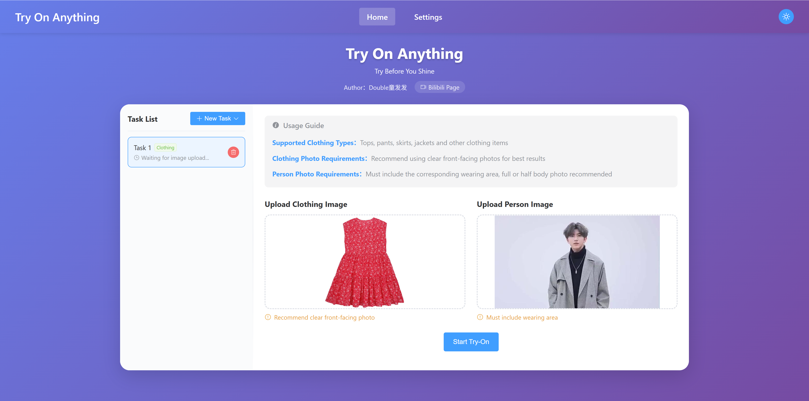

# Try On Anything

<div align="center">

[中文](../README.md) | [English](README_en.md)

[](https://www.python.org/)
[](https://nodejs.org/)
[](https://vuejs.org/)
[](https://fastapi.tiangolo.com/)
[](https://space.bilibili.com/323109608)
[](../LICENSE)

**Author: Double童发发** · [Bilibili](https://space.bilibili.com/323109608)




</div>

## 📖 Project Overview

Thanks to the flourishing development of diffusion models, many mature implementation solutions for virtual clothing try-on have emerged in the market. However, due to the characteristics of accessories such as diverse types, various shapes, different sizes, and varying wearing positions, the implementation difficulty of virtual accessory try-on is far greater than virtual clothing try-on. I once attempted to develop a virtual accessory try-on tool based on diffusion models + conditional control + Inpainting in 2024, but ultimately abandoned it due to poor results. 2025 is an exciting year, as image generation models represented by Nano Banana and Tongyi Wanxiang have made tremendous improvements in image generation quality compared to 2024, especially in text generation and fine detail control. In addition, with the increasing maturity of multimodal large model technology, the capability of vision-language models in visual understanding has been greatly enhanced. Against this backdrop, I decided to go all-in and combine vision-language models and image generation models to develop a "Try On Anything" tool that can not only achieve virtual accessory try-on, but also be compatible with clothing, tech products, and everything else.

In the initial release, this project relies on vision-language models and image generation models to first implement a virtual accessory try-on system. Users only need to upload accessory photos and person photos containing the wearing area (face is not required), and the system can naturally place accessories (necklaces, earrings, watches, bracelets, etc.) onto person photos, generating realistic try-on effect images. The vision-language model is responsible for deep understanding of the user-uploaded accessory photos, extracting accessory type, wearing position, and accessory detail area, and returning the information to the image generation model; the image generation model is responsible for intelligently fusing the accessory image with the person image to generate realistic try-on effect images.

Due to the large scale and complex functionality of the project, I will continue to iterate and develop more features in the future. Stay tuned!

This project uses AI Coding technology to assist programming. I would like to express my sincere gratitude to a series of AI Coding tools represented by [Claude Code](https://claude.com/product/claude-code), [Cursor](https://cursor.com/), and [GitHub Copilot](https://github.com/features/copilot), which have greatly improved my programming efficiency and allowed me to focus more on the implementation of algorithm logic.

## 🎯 Key Features

### v1.0.0: Virtual Accessory Try-On Basic Features
- **Intelligent Recognition**: Automatically identifies accessory types (necklaces, earrings, watches, bracelets, etc.) and optimal wearing positions based on vision-language models
- **High-Quality Generation**: Generates natural and realistic try-on effects based on premium image generation models
- **Flexible Configuration**: Supports manual specification of accessory types and positions for fine-grained requirements
- **Easy Deployment**: Provides one-click startup script for quick local service setup
- **Async Architecture**: Supports multiple try-on tasks running asynchronously
- **Bilingual Support**: Complete Chinese-English interface switching
- **Periodic Task Cleanup**: Regularly cleans up expired tasks and their folders to avoid excessive storage usage

## 📋 Requirements

- Python >= 3.13
- Node.js >= 18
- Alibaba Cloud DashScope API Key (for Qwen VL model and Tongyi Wanxiang (Wan) image generation model)

## 🚀 Quick Start

### 1. Clone the Repository

```bash
git clone https://github.com/TongTong313/try-on-anything.git
cd try-on-anything
```

### 2. Configure API Key

The system supports two API Key configuration methods:

**Method 1: Using Environment Variables**

The advantage of this method is one-time configuration for multiple uses, and there is basically no risk of API Key leakage since environment variables are configured on the local machine and will not be uploaded to remote repositories.

Create a `.env` file or set environment variables:

**Windows (PowerShell):**
```powershell
# Temporary setting (current session)
$env:DASHSCOPE_API_KEY="your-api-key-here"

# Permanent setting (user level)
[System.Environment]::SetEnvironmentVariable('DASHSCOPE_API_KEY', 'your-api-key-here', 'User')
```

**Linux/Mac (Bash):**
```bash
# Temporary setting (current session)
export DASHSCOPE_API_KEY="your-api-key-here"

# Permanent setting (add to config file)
echo 'export DASHSCOPE_API_KEY="your-api-key-here"' >> ~/.bashrc
source ~/.bashrc
```

**Note:**
- Environment variable configuration for API Key currently **only supports Alibaba Cloud DashScope**. To apply, visit: https://bailian.console.aliyun.com/

**Method 2: Configure in Frontend Settings Page (Recommended for Production)**

Of course, if you don't want to configure environment variables, you can also configure the API Key in the frontend settings page. The downside is that you need to manually enter the API Key each time, and the risk of API Key leakage is relatively higher.

1. After starting the application, visit the frontend page
2. Click the "Settings" button in the top navigation bar
3. Select "Manually Input API Key"
4. Enter API Keys for VL model and image generation model respectively
5. Click "Save Settings"

**Note:**
- Frontend settings page configuration for API Key currently **only supports Alibaba Cloud DashScope**. To apply, visit: https://bailian.console.aliyun.com/
- It is strongly recommended to click the `Test Connection` button first. Only save settings after the connection test succeeds to avoid configuration errors that prevent normal use.

### 3. Install Dependencies

```bash
# Install backend dependencies (using uv recommended)
uv sync

# Or use pip
pip install -e .

# Install frontend dependencies
cd frontend
npm install
cd ..
```

### 4. Start Services

**Method 1: One-Click Startup (Recommended)**

```bash
# Run in project root directory (using default configuration)
python scripts/start.py
# Or use uv
uv run scripts/start.py

# Customize backend service address and port
python scripts/start.py --host 127.0.0.1 --port 8080
# Or use uv
uv run scripts/start.py --host 127.0.0.1 --port 8080

# Only modify port
python scripts/start.py --port 9000
# Or use uv
uv run scripts/start.py --port 9000

# View help information
python scripts/start.py --help
# Or use uv
uv run scripts/start.py --help
```

**Command Line Arguments:**
- `--host`: Backend service listening host address (default: 0.0.0.0)
- `--port`: Backend service listening port (default: 8000)

After startup, you can access:
- Backend address: http://localhost:8000 (or custom address and port)
- API documentation: http://localhost:8000/docs
- Frontend address: http://localhost:5173

**Method 2: Manual Separate Startup**

Suitable for scenarios requiring separate debugging of frontend or backend.

**Start Backend Service:**
```bash
# Run in project root directory
uv run uvicorn backend.app.main:app --host 0.0.0.0 --port 8000
```

Backend service will start at http://localhost:8000, API documentation: http://localhost:8000/docs

**Start Frontend Service:**
```bash
cd frontend
npm run dev
```

Frontend service will start at http://localhost:5173

## 📝 Usage Instructions

1. Open browser and visit http://localhost:5173
2. Upload accessory image (supports necklaces, earrings, watches, bracelets, etc.)
3. Upload person image
4. Optional: Manually specify accessory type and wearing position in advanced settings
5. Click "Start Try-On" button
6. Wait for system to generate try-on effect image (approximately 30-60 seconds)
7. View results and download

## ⚙️ Advanced Settings

### Internationalization Support

The system supports Chinese-English bilingual switching. You can change the language in the Settings page, and your preference will be automatically saved to the browser.

### API Configuration

Provides flexible API configuration options:

- **Environment Variable Mode**: Suitable for development, system automatically reads environment variables
- **Manual Input Mode**: Suitable for production, configure API Key directly in the frontend page
- **Secure Storage**: API Keys are encrypted, with show/hide and connection test features

### Help Documentation

Click the "Help" button in the top navigation bar to view the complete project documentation.

## 📡 API Endpoints

| Endpoint | Method | Description |
|----------|--------|-------------|
| `/api/tryon/submit` | POST | Submit try-on task |
| `/api/tryon/status/{task_id}` | GET | Query task status |
| `/api/tryon/result/{task_id}` | GET | Get task result |
| `/api/tryon/task/{task_id}` | DELETE | Delete task |
| `/api/tryon/resubmit/{task_id}` | PUT | Resubmit task |
| `/api/tryon/test-connection` | POST | Test API Key connection |

For detailed API documentation, visit: http://localhost:8000/docs

## 🛠️ Tech Stack

**Backend**
- FastAPI - Web framework
- Uvicorn - ASGI server

**Frontend**
- Vue 3 - Frontend framework
- Element Plus - UI component library
- Vite - Build tool
- Axios - HTTP client

## 📞 Help & Support

The project inevitably has shortcomings. If you encounter any problems or suggestions during use, please feel free to submit feedback through [GitHub Issues](https://github.com/TongTong313/try-on-anything/issues). I will respond and address them as soon as I see them.

## 📄 License

MIT License - See [LICENSE](../LICENSE) file for details
